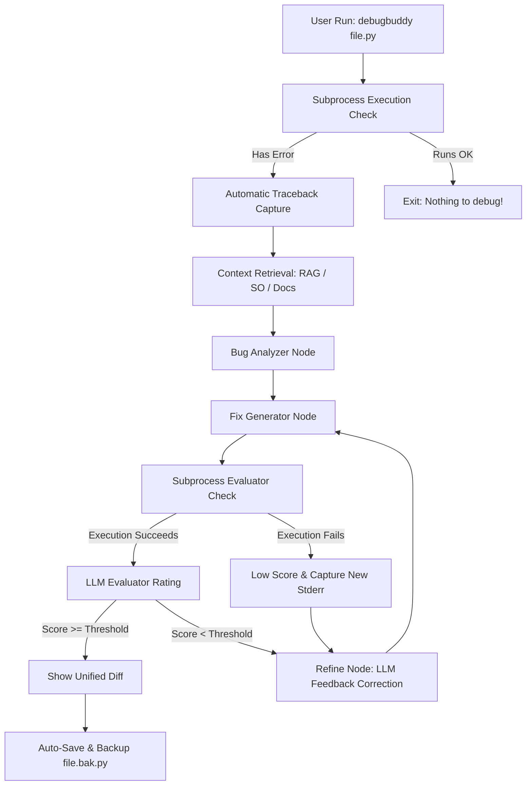

# 🐛 Debug Buddy

> An AI-powered CLI debugging agent that doesn't just suggest fixes — it **executes, validates, and iteratively refines** them in a subprocess loop until your code actually works.

---

## 🚀 What is Debug Buddy?

Debug Buddy is an intelligent command-line tool that acts like a senior engineer reviewing and fixing your broken code. Most AI coding tools stop at "here's a suggestion." Debug Buddy closes the loop:

```
Understand ➔ Fix ➔ Subprocess Execute ➔ Capture Tracebacks ➔ Evaluator Scoring ➔ Refine Loop
```

Give it a Python file, and Debug Buddy will automatically run the code, extract the traceback, run semantic search over documentation, generate a candidate fix, evaluate it by executing it in a sandbox, and repeat the loop until it runs without errors.

---

## ✨ Key Features

* **⚡ Zero-Config Auto Execution** — Don't bother copy-pasting tracebacks. Simply run `debugbuddy file.py`. The tool runs the script, extracts the traceback, and feeds it into the agent automatically.
* **⚙️ Sandbox Subprocess Validation** — Actually executes the corrected code in an isolated subprocess to verify runtime correctness rather than relying solely on static analysis.
* **🔄 True Self-Correction Loop** — If the fix raises a new exception, Debug Buddy captures the new traceback and passes it back to the LLM to write a revised fix.
* **🎨 Interactive Git-Style Diffs** — Displays a beautiful, color-coded unified diff showing exactly what lines are proposed to change before writing the file.
* **🌐 Dynamic Multi-LLM Support** — Dynamically loads OpenAI (e.g. `gpt-4o-mini`), Google Gemini (e.g. `gemini-1.5-flash`), or NVIDIA AI Endpoints based on your `.env` configuration.
* **🖥️ Windows UTF-8 Support** — Built-in console stream reconfiguration to prevent encoding crashes on Windows cmd/powershell environments when printing emojis or styled blocks.

---

## 🛠️ Architecture



---

## 📂 Project Structure

```
debug-buddy/
├── agents/          # Agent logic and LLM nodes
│   ├── bug_analyzer.py      # Category classification and root cause analysis
│   ├── evaluator_agent.py   # Code execution and LLM scoring
│   ├── fix_generator.py     # LLM code correction
│   ├── retrieval_agent.py   # Scrapes and splits reference docs into vector store
│   └── refinement_loop.py   # Agentic feedback routines
├── core/            # Debugging engine helpers
│   ├── executor.py          # Subprocess PythonExecutor (sandboxed runs)
│   ├── llm_client.py        # Dynamic provider instantiator (OpenAI, Gemini, NVIDIA)
│   └── logger.py            # Console and file logger
├── graph/           # LangGraph workflow definition
│   ├── graph.py             # Compiled state graph
│   ├── nodes.py             # Graph node executors
│   └── state.py             # Typed dictionary pipeline state
├── routes/          # CLI Typer routes
│   └── debug.py             # Entry points, diff UI, console stream settings
├── tests/           # Verification suite
│   └── test_agents.py       # PyTest suite for executor, LLM, and UI utils
├── main.py          # Unified entrypoint
├── pyproject.toml   # Script metadata and package declarations
└── requirements.txt # Project dependencies
```

---

## 🏁 Getting Started

### 1. Clone the repository
```bash
git clone https://github.com/Sohan-patnaik/debug-buddy.git
cd debug-buddy
```

### 2. Install package in editable mode
```bash
pip install -e .
```
This installs the tool and registers the global `debugbuddy` and `debug-buddy` commands on your system path.

### 3. Set your environment variables
Create a `.env` file in the root directory:
```env
# Choose provider: nvidia, openai, or gemini
LLM_PROVIDER=nvidia

# Provide keys for your selected provider
NVIDIA_API_KEY=your_nvidia_key_here
OPENAI_API_KEY=your_openai_key_here
GEMINI_API_KEY=your_gemini_key_here
```

### 4. Running the Tests
Ensure everything works out-of-the-box:
```bash
python -m pytest tests/
```

---

## 📖 CLI Usage Examples

### Auto-run and Debug a File
Runs the file, grabs the traceback, crawls for docs, fixes it, evaluates it, shows the unified diff, and prompts to save:
```bash
debugbuddy script.py
```

### Debug with a specific traceback message
```bash
debugbuddy script.py -e "ZeroDivisionError: division by zero"
```

### Options & Flags
* `--iters`, `-i`: Max refinement iterations (default: `3`)
* `--threshold`, `-t`: Score threshold (0.0 to 1.0) to accept a fix (default: `0.5`)
* `--save`, `-s`: Auto-save the fix and bypass the confirmation prompt.
* `--analyze-only`, `-a`: Stop after generating root cause analysis; do not generate or run fixes.

---

## 🎓 Skills Demonstrated

* **Agentic AI & LangGraph** — Multi-agent state machines, self-correction loops, and structured LLM tool invocation.
* **LLM Engineering** — Multi-provider clients, prompt optimization, and structured output parsing.
* **Systems Programming** — Subprocess sandboxing, runtime monitoring, and traceback parsing.
* **Developer Experience (UX)** — Rich console styling, real-time progress indicators, and interactive unified git diff displays.
* **Professional Engineering** — Unit test coverage with `pytest`, fallback configuration mechanisms, and robust encoding workarounds.

---

## 👨‍💻 Author

**Sohan Patnaik**  
[GitHub](https://github.com/Sohan-patnaik)
